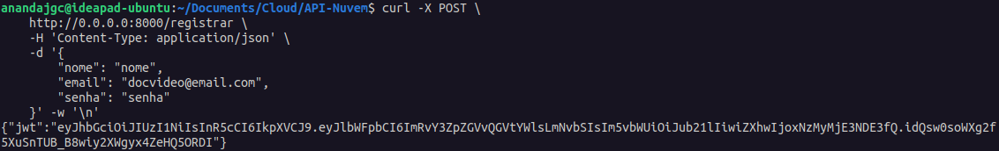

# Projeto de API RESTful com FastAPI

## Sumário

1. [Descrição do Projeto](#descrição-do-projeto)
2. [Funcionalidades Implementadas](#funcionalidades-implementadas)
3. [Estrutura do Código](#estrutura-do-código)
4. [Como Executar a Aplicação](#como-executar-a-aplicação)
5. [Usando a API](#usando-a-api)

## Descrição do Projeto

Este projeto é uma API RESTful desenvolvida com FastAPI para realizar o cadastro e autenticação de usuários e consultar dados meteorológicos da API OpenWeatherMap. A aplicação é composta por diversas funcionalidades, incluindo registro de usuários, autenticação via JWT (JSON Web Token), e consulta de previsões do tempo.

## Funcionalidades Implementadas

**1. Registro de Usuários:**

- Endpoint: `POST /registrar`
- Recebe dados do usuário como parâmetros:
```json
{
    "nome": "string",
    "email": "string",
    "senha": "string"
}
```
- Verifica se o email já está registrado.
- Hash da senha utilizando bcrypt.
- Armazena o novo usuário no banco de dados e retorna um token JWT:
```json
{
    "jwt": "string"
}
```

**2. Autenticação de Usuários:**

- Endpoint: `POST /login`
- Recebe email e senha do usuário como parâmetros:
```json
{
    "email": "string",
    "senha": "string"
}
```
- Verifica as credenciais e autentica o usuário.
- Retorna um token JWT para acesso autorizado:
```json
{
    "jwt": "string"
}
```

**3. Consulta de Previsão do Tempo:**

- Endpoint: `GET /consultar`
- Requer um token JWT válido:
```json
    Authorization: Bearer token_de_usuário
```
- Faz uma requisição à API OpenWeatherMap utilizando as coordenadas especificadas.
- Formata e retorna os dados da previsão do tempo:
```json
{
    "city": "string",
    "country": "string",
    "forecast": {
        "time": "string",
        "temperature": "number",
        "feels_like": "number",
        "temp_min": "number",
        "temp_max": "number",
        "pressure": "number",
        "humidity": "number",
        "weather": "string",
        "weather_icon": "string",
        "clouds": "number",
        "wind_speed": "number",
        "wind_deg": "number",
        "visibility": "number",
        "pop": "number",
        "rain": "number",
        "snow": "number"
    }
}
```

## Estrutura do Código

**1. Importações e Configurações:**

- Carrega variáveis de ambiente (chave secreta, URL do banco de dados, chave da API do OpenWeatherMap).
- Configura a conexão com o banco de dados usando SQLAlchemy.

**2. Definições de Modelos:**

- `User`: Modelo Pydantic para validação de dados de entrada de usuários.
- `Login`: Modelo Pydantic para validação de dados de login.
- `UserDB`: Modelo SQLAlchemy para representar a tabela de usuários no banco de dados.

**3. Funções de Utilidade:**

- `create_token`: Cria um token JWT com dados do usuário e um tempo de expiração.
- `verify_token`: Verifica e decodifica um token JWT.
- `get_db`: Gerencia a sessão do banco de dados.

**4. Endpoints da API:**

- `registrar`: Registra um novo usuário.
- `login`: Autentica um usuário existente.
- `consultar`: Consulta a previsão do tempo após verificar o token JWT.

## Como Executar a Aplicação

**1. Pré-requisitos:**

- Docker

**2. Configuração:**

- Crie um arquivo `.env` na raiz do projeto e defina as seguintes variáveis:
```dotenv
SECRET_KEY=sua_senha
DATABASE_URL=postgresql://user:password@db:5432/dbname
OPENWEATHERMAP_API_KEY=sua_chave_api_openweathermap
POSTGRES_USER=user
POSTGRES_PASSWORD=password
POSTGRES_DB=dbname
```

**3. Execute a aplicação com Docker Compose:**

- O arquivo compose.yml pode ser encontrado [`aqui`](https://github.com/AnandaCampelo/API-Nuvem/blob/main/compose.yml).

```sh
    docker compose up -d
```

- Após isso você pode acessar a documentação em [`http://0.0.0.0:8000/docs`](http://0.0.0.0:8000/docs)

## Usando a API

- `registrar`:

```sh
    curl -X POST \
    http://0.0.0.0:8000/registrar \
    -H 'Content-Type: application/json' \
    -d '{
        "nome": "seu_nome",
        "email": "seu_email",
        "senha": "sua_senha"
    }' -w '\n'
```

- `login`:

```sh
    curl -X POST \
    http://0.0.0.0:8000/login \
    -H 'Content-Type: application/json' \
    -d '{
        "email": "seu_email",
        "senha": "sua_senha"
    }' -w '\n'
```

- `consultar`:

```sh
    curl -X GET \
    http://0.0.0.0:8000/consultar \
    -H 'Authorization: Bearer seu_token_jwt_aqui' \
    -H 'accept: application/json' -w '\n'
```

### Vídeo Exemplo

<div style="text-align: center;">
  <video width="640" controls>
    <source src="video_exemplo.webm" type="video/webm">
  </video>
</div>

### Imagens Exemplo

- Registrar:

<div style="text-align: center;">
  
</div>

- Login:

<div style="text-align: center;">
  
</div>

- Consultar:

<div style="text-align: center;">
  
</div>